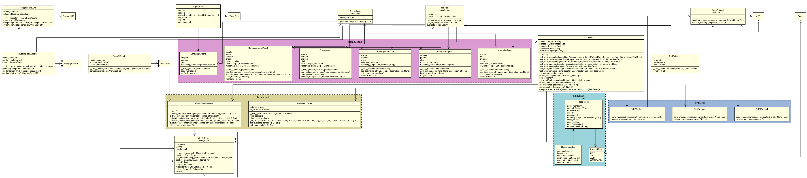

# MASTIF (Multi-Agent System TestIng Framework)

<div align="center">
  
</div>

## Overview

MASTIF (Multi-Agent System TestIng Framework) is a comprehensive benchmarking suite for evaluating multi-agent systems using AI technologies across multiple frameworks, protocols, and Generative AI  models (LLMs). It supports both standard user-defined tasks and the [Mind2Web benchmark](https://github.com/OSU-NLP-Group/Mind2Web), enabling reproducible assessment of agent reasoning, tool use, and web interaction capabilities.

**Key Capabilities:**

- **Multi-Framework Support:** Evaluates agents built with CrewAI, Smolagents, LangChain, LangGraph, LlamaIndex, and Semantic Kernel.
- **Multi-Model Support:** Supports models from both HuggingFace and OpenAI models, including open-source and proprietary LLMs.
- **Protocol Flexibility:** Assesses agent performance under various prompting and reasoning protocols (e.g., MCP, A2A, ACP, standard).
- **Mind2Web Benchmark Integration:** Runs large-scale, real-world web interaction tasks from the Mind2Web dataset, with automatic sampling and domain breakdowns.
- **Token Consumption Metrics:** Tracks and reports reasoning tokens, output tokens, and total tokens spent for each test, framework, protocol, and model.
- **Detailed Metrics Collection:** Captures reasoning steps, latency, task understanding, task deviation, task completion, and domain-specific performance.
- **Extensible Tool Use:** Evaluates agent tool-calling and web search capabilities.
- **Flexible Configuration:** Supports switching between models, frameworks, and protocols via environment variables or code.
- **Comprehensive Output:** Exports results in machine-readable (JSON) formats with detailed summaries and breakdowns. Files `out-standard.txt` and `out-mind2web.txt` show examples of human readable console output.
- **Judge Model Integration:** You can use LLM-as-a-judge (e.g., GPT-4o-mini) for scoring and evaluation of agent outputs.

MASTIF framework is designed for researchers, developers, and practitioners who want to systematically compare agentic AI stacks, understand their strengths and weaknesses, and drive improvements in agent reasoning and web automation.

## Class Diagram



## Installation

```bash
# Install additional dependency for Mind2Web
pip install datasets

# Existing dependencies
pip install huggingface_hub transformers torch
pip install openai
pip install crewai smolagents
pip install langchain langchain-community langgraph
pip install llama-index
pip install semantic-kernel
```

## Usage

### Standard Mode (Original Testing)
```bash
export HF_TOKEN='your_token'
export OPEN_AI_KEY='your_key'
export JUDGE_MODEL='gpt-4o-mini'
export TEST_MODE='standard'
python main.py
```

### Mind2Web Evaluation Mode
```bash
export HF_TOKEN='your_token'
export OPEN_AI_KEY='your_key'
export JUDGE_MODEL='gpt-4o-mini'
export TEST_MODE='mind2web'
export MIND2WEB_NUM_TASKS=10  # Use 10 tasks (default)
python main.py
```

### Test All Mind2Web Tasks
```bash
export HF_TOKEN='your_token'
export OPEN_AI_KEY='your_key'
export JUDGE_MODEL='gpt-4o-mini'
export TEST_MODE='mind2web'
export MIND2WEB_NUM_TASKS=0  # 0 means use ALL tasks
python main.py
```

## Configuration

### Environment Variables
- `TEST_MODE`: 'standard' or 'mind2web'
- `MIND2WEB_NUM_TASKS`: Number of tasks (10-2350, or 0 for all)
- `HF_TOKEN`: Your HuggingFace API token
- `OPEN_AI_KEY`: Your OpenAI API key
- `JUDGE_MODEL`: OpenAI llm-as-a-judge model

### Sample Sizes
- **10 tasks**: Quick evaluation (~15 minutes)
- **50 tasks**: Medium evaluation (~1 hour)
- **100 tasks**: Comprehensive sample (~2 hours)
- **All tasks** (2,350): Full benchmark (~24+ hours)

## Output Files

### Mind2Web Mode
- `logs/mind2web-results-TIMESTAMP.json`: Mind2Web specific metrics
- `logs/results-TIMESTAMP.json`: Standard test results

### Metrics Included
- Task Understanding: Agent's comprehension of the task
- Task Deviation: Agent's adherence to the task in reasoning steps
- Task Completion: Agent's performance on fulfilling the task
- Reasoning Steps: Number of intermediate reasoning steps
- Domain-specific performance breakdowns

## Example Output

- Standard mode with user defined tasks: [out-standard.txt](./out-standard.txt)
- Mind2Web mode with benchmark tasks: [out-mind2web.txt](./out-mind2web.txt)

## Notes

- Mind2Web requires authentication with HuggingFace
- The test set requires accepting terms on HuggingFace
- Focus is on task understanding and action planning capabilities

## AI Attribution

AIA Human-AI blend, Content edits, Human-initiated, Reviewed, Copilot and Sonet 4.5 v1.0

More info: https://aiattribution.github.io/create-attribution