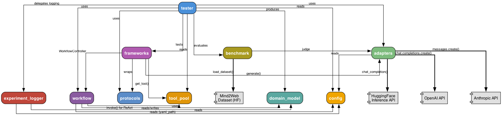
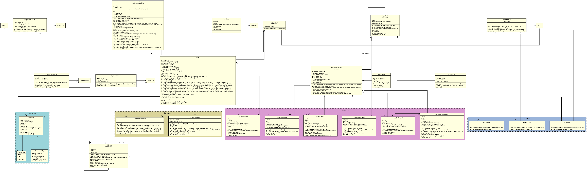

# MASTIF (Multi-Agent System TestIng Framework)

<div align="center">
  
</div>

## Overview

MASTIF (Multi-Agent System TestIng Framework) is a comprehensive benchmarking suite for evaluating multi-agent systems using AI technologies across multiple frameworks, protocols, and Generative AI  models (LLMs). It supports both standard user-defined tasks and the [Mind2Web benchmark](https://github.com/OSU-NLP-Group/Mind2Web), enabling reproducible assessment of agent reasoning, tool use, and web interaction capabilities.

**Key Capabilities:**

- **Multi-Framework Support:** Evaluates agents built with CrewAI, Smolagents, LangChain, LangGraph, LlamaIndex, and Semantic Kernel.
- **Multi-Model Support:** Supports models from both HuggingFace and OpenAI models, including open-source and proprietary LLMs.
- **Protocol Flexibility:** Assesses agent performance under various prompting and reasoning protocols (e.g., MCP, A2A, ACP, standard).
- **ReAct Workflow Support:** Automatically parses and executes plain-text tool calls from models that don't support structured tool calls, enabling tool use across a wider range of models.
- **Mind2Web Benchmark Integration:** Runs large-scale, real-world web interaction tasks from the Mind2Web dataset, with automatic sampling and domain breakdowns.
- **Token Consumption Metrics:** Tracks and reports reasoning tokens, output tokens, and total tokens spent for each test, framework, protocol, and model.
- **Tool Usage Analytics:** Aggregates and displays detailed tool invocation statistics across all test combinations, helping identify which tools are most effective.
- **Intermediate Result Saving:** Automatically saves partial results during long-running benchmarks, allowing progress monitoring and recovery from interruptions.
- **Detailed Metrics Collection:** Captures reasoning steps, latency, task understanding, task adherence, task completion, and domain-specific performance.
- **Extensible Tool Use:** Evaluates agent tool-calling and web search capabilities with 15+ built-in tools.
- **Flexible Configuration:** Supports switching between models, frameworks, and protocols via environment variables or code, with YAML-based workflow definitions.
- **Comprehensive Output:** Exports results in machine-readable (JSON) formats with detailed summaries and breakdowns. Files `out-standard.txt` and `out-mind2web.txt` show examples of human readable console output.
- **Judge Model Integration:** You can use LLM-as-a-judge (e.g., GPT-4o-mini) for scoring and evaluation of agent outputs.

MASTIF framework is designed for researchers, developers, and practitioners who want to systematically compare agentic AI stacks, understand their strengths and weaknesses, and drive improvements in agent reasoning and web automation.

## Component Diagram



## Class Diagram



## Installation

### 1. Create and Activate a Virtual Environment

```bash
python3 -m venv venv
source venv/bin/activate
```

### 2. Install Dependencies

#### 2.1 Requirements.txt

```bash
# Install all dependencies considering all the specific versions used in the project
pip install -r requirements.txt
```

#### 2.2 Fresh Install

```bash
# Install dependency for Mind2Web
pip install datasets

# Install core
pip install \
  huggingface-hub \
  openai \
  pydantic \
  pyyaml \
  python-dotenv \
  requests \
  tiktoken \
  transformers

# Install agentic frameworks
pip install langchain langchain-community langchain-core langgraph
pip install crewai crewai-tools
pip install smolagents
pip install llama-index llama-index-core llama-index-llms-huggingface-api
pip install semantic-kernel

# Install tool pool dependencies
pip install duckduckgo-search
pip install playwright
playwright install chromium
pip install wikipedia
pip install arxiv
pip install RestrictedPython
pip install beautifulsoup4
pip install pypdf requests
pip install biopython
pip install youtube-transcript-api
pip install sympy
```

## Usage

MASTIF supports 2 types of tests: 

1. Custom tasks 
2. Benchmark tasks; the currently supported benchmark is [Mind2Web benchmark](https://github.com/OSU-NLP-Group/Mind2Web).

For custom tasks, `HF_TOKEN` is required and `OPENAI_API_KEY` is only needed if you configure tests with `gpt-*` models.

For Mind2Web tasks, the following two keys are required, as MASTIF currently considers OpenAI models to judge outputs from benckmark tasks.

```bash
export HF_TOKEN='your_token'
export OPENAI_API_KEY='your_key'
```

Make a copy of [experiments.yaml](./experiments/example.yaml), rename it, and customize it according to your needs.

```bash
python main.py experiments/[your experiment file].yaml
```

### Configuration Options

MASTIF supports extensive configuration through YAML files:

- **Model Settings**: `temperature`, `max_tokens`, `max_steps`, `max_tool_rounds`
- **Workflow Definition**: Custom node sequences with prompt templates and looping logic
- **Tool Configuration**: Detailed tool descriptions and usage guidelines
- **Test Parameters**: Model selection, protocol choices, framework combinations

See [experiments/example.yaml](./experiments/example.yaml) for a complete configuration reference.

### Workflow Configuration

MASTIF supports configurable agent workflows through YAML definitions. Each workflow consists of nodes that execute in sequence, with support for looping and tool integration:

```yaml
workflow:
  nodes:
    - name: "plan"
      prompt_template: "prompts/plan.txt"
      output_key: "plan"
      loop: false

    - name: "research"
      prompt_template: "prompts/react-loop.txt"  # ReAct-enabled prompt
      output_key: "research_results"
      loop: true

    - name: "report"
      prompt_template: "prompts/react-synthesize.txt"
      output_key: "final_report"
      loop: false

  entry_node: "plan"
  exit_node: "report"
```

**ReAct Support:** Workflows can use ReAct-style prompts that enable plain-text tool calling for models without structured tool call APIs.

### Tool Usage and Intermediate Results

MASTIF provides detailed tool usage analytics and progress monitoring:

- **Tool Usage Tracking:** Displays which tools were invoked and how many times across all test combinations
- **Intermediate Snapshots:** Automatically saves partial results after each model and framework-protocol combination
- **Progress Monitoring:** Monitor long-running benchmarks with real-time progress updates

### Mind2Web Sample Sizes
- **10 tasks**: Quick evaluation (~15 minutes)
- **50 tasks**: Medium evaluation (~1 hour)
- **100 tasks**: Comprehensive sample (~2 hours)
- **All tasks** (2,350): Full benchmark (~24+ hours)

## Output Files

### Standard Mode
- `logs/results-TIMESTAMP.json`: Complete test results with detailed metrics
- `logs/intermediate-results-*.json`: Partial results saved during execution for progress monitoring

### Mind2Web Mode
- `logs/mind2web-results-TIMESTAMP.json`: Mind2Web specific metrics
- `logs/results-TIMESTAMP.json`: Standard test results
- `logs/intermediate-mind2web-*.json`: Partial Mind2Web results saved during execution

### Metrics Included
- Task Understanding: Agent's comprehension of the task
- Task Adherence: Agent's adherence to the task in reasoning steps
- Task Completion: Agent's performance on fulfilling the task
- Reasoning Steps: Number of intermediate reasoning steps
- Tool Usage: Detailed breakdown of which tools were invoked and how frequently
- Domain-specific performance breakdowns
- Token consumption metrics (reasoning, output, total)

## Example Output

- Standard mode with user defined tasks: [out-standard.txt](./out-standard.txt)
- Mind2Web mode with benchmark tasks: [out-mind2web.txt](./out-mind2web.txt)

## Tool Capabilities

MASTIF includes 15+ built-in tools for comprehensive agent evaluation:

### Core Tools
- **web_search**: DuckDuckGo web search for current information
- **web_browser**: Playwright-based headless browser navigation
- **requests_get**: HTTP GET requests for programmatic access
- **beautifulsoup_scraper**: HTML structure extraction and parsing

### Knowledge Tools
- **wikipedia**: Encyclopedic knowledge lookups
- **arxiv**: Academic paper search
- **pubmed**: Biomedical literature search

### Computation Tools
- **python_repl**: Sandboxed Python code execution
- **sympy**: Symbolic mathematics and equation solving
- **json_parser**: JSON parsing and querying

### Content Tools
- **pdf_reader**: PDF text extraction
- **youtube_transcript**: YouTube video transcript retrieval
- **datetime**: Current date/time information

### Specialized Tools
- **web_interaction**: Multi-step web interactions for complex tasks
- **keyboard_interaction**: Keyboard-driven accessibility-focused interactions

### ReAct Tool Execution

MASTIF automatically detects and executes tools from plain-text ReAct format responses:

```
Thought: I need to search for information
Action: web_search
Action Input: {"query": "accessibility guidelines"}

Observation: [Search results...]
```

This enables tool use across models that don't support structured tool calls, expanding compatibility with open-source and fine-tuned models.

## Notes

- Mind2Web requires authentication with HuggingFace
- The test set requires accepting terms on HuggingFace
- Focus is on task understanding and action planning capabilities
- ReAct parsing enables tool use across a wider range of models
- Intermediate snapshots allow monitoring of long-running benchmarks

## AI Attribution

<a href="https://aiattribution.github.io/statements/AIA-HAb-Ce-Hin-R-?model=Copilot,%20ChatGPT%205.2,%20Gemini%203,%20Sonnet%204.5,%20and%20Sonnet%204.6%20v1.0" target="_blank">AIA Human-AI blend, Content edits, Human-initiated, Reviewed, Copilot, ChatGPT 5.2, Gemini 3, Sonnet 4.5, and Sonnet 4.6 v1.0</a>

More info: https://aiattribution.github.io/